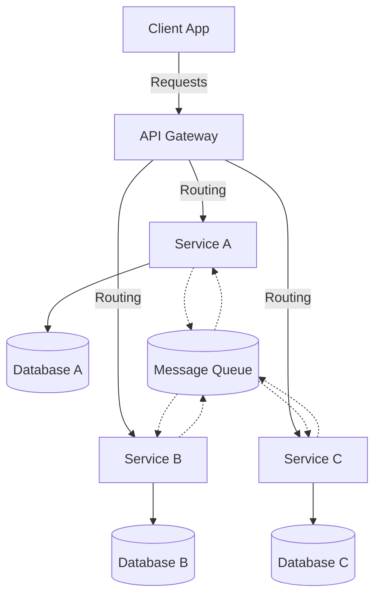
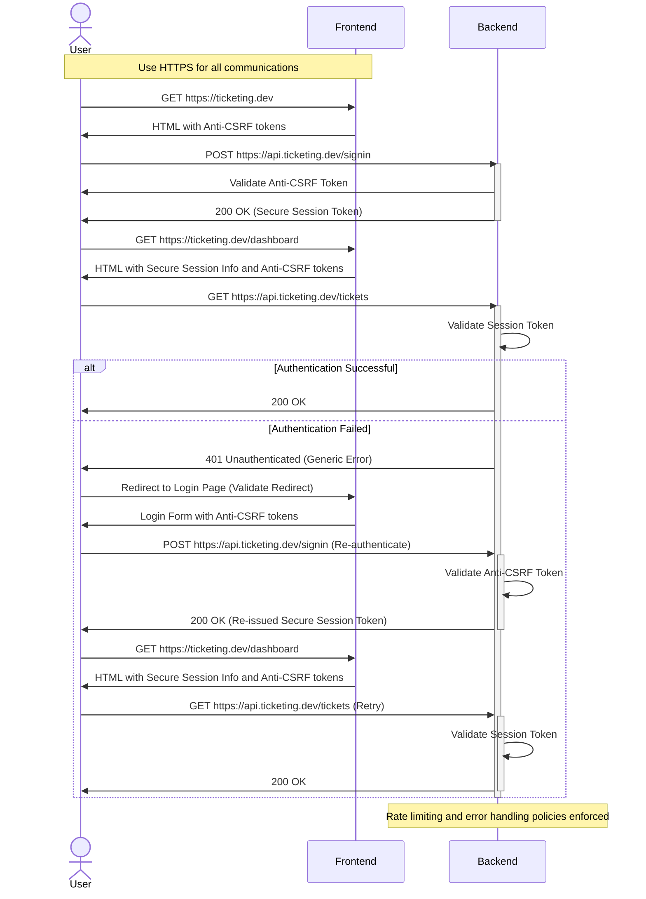
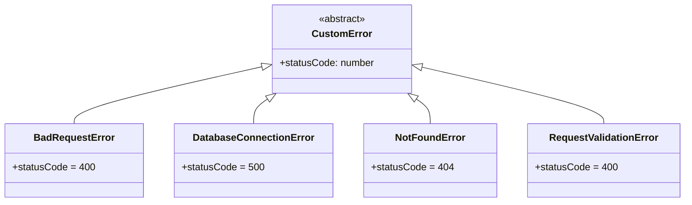

# ticketing

```mermaid
graph TB;
    Client[Client App] -->|Requests| AG[API Gateway]
    AG -->|Routing| MS1[Service A]
    AG -->|Routing| MS2[Service B]
    AG -->|Routing| MS3[Service C]

    MS1 --> DB1[(Database A)]
    MS2 --> DB2[(Database B)]
    MS3 --> DB3[(Database C)]

    MS1 -.-> MQ[(Message Queue)]
    MS2 -.-> MQ
    MS3 -.-> MQ

    MQ -.-> MS1
    MQ -.-> MS2
    MQ -.-> MS3
```

```mermaid
sequenceDiagram
    actor User
    participant Frontend
    participant Backend

    Note over User,Frontend: Use HTTPS for all communications

    User->>Frontend: GET https://ticketing.dev
    Frontend->>User: HTML with Anti-CSRF tokens

    User->>Backend: POST https://api.ticketing.dev/signin
    activate Backend
    Backend->>User: Validate Anti-CSRF Token
    Backend->>User: 200 OK (Secure Session Token)
    deactivate Backend

    User->>Frontend: GET https://ticketing.dev/dashboard
    Frontend->>User: HTML with Secure Session Info and Anti-CSRF tokens

    User->>Backend: GET https://api.ticketing.dev/tickets
    activate Backend
    Backend->>Backend: Validate Session Token
    alt Authentication Successful
        Backend->>User: 200 OK
    else Authentication Failed
        Backend->>User: 401 Unauthenticated (Generic Error)
        User->>Frontend: Redirect to Login Page (Validate Redirect)
        Frontend->>User: Login Form with Anti-CSRF tokens
        User->>Backend: POST https://api.ticketing.dev/signin (Re-authenticate)
        activate Backend
        Backend->>Backend: Validate Anti-CSRF Token
        Backend->>User: 200 OK (Re-issued Secure Session Token)
        deactivate Backend
        User->>Frontend: GET https://ticketing.dev/dashboard
        Frontend->>User: HTML with Secure Session Info and Anti-CSRF tokens
        User->>Backend: GET https://api.ticketing.dev/tickets (Retry)
        activate Backend
        Backend->>Backend: Validate Session Token
        Backend->>User: 200 OK
        deactivate Backend
    end
    deactivate Backend

    Note over Backend: Rate limiting and error handling policies enforced
```

```mermaid
classDiagram
CustomError <|-- BadRequestError
CustomError <|-- DatabaseConnectionError
CustomError <|-- NotFoundError
CustomError <|-- RequestValidationError
class CustomError {
  <<abstract>>
  +statusCode: number
}
class BadRequestError {
  +statusCode = 400
}
class DatabaseConnectionError {
  +statusCode = 500
}
class NotFoundError {
  +statusCode = 404
}
class RequestValidationError {
  +statusCode = 400
}
```