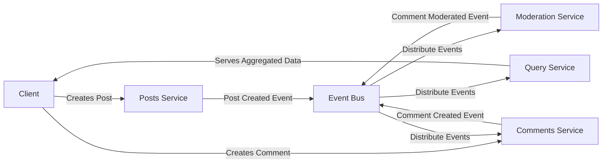
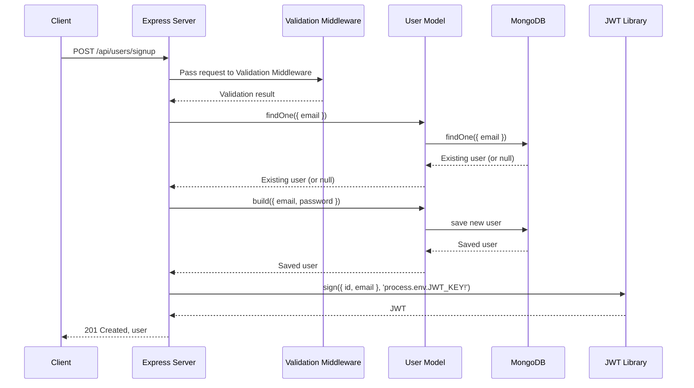
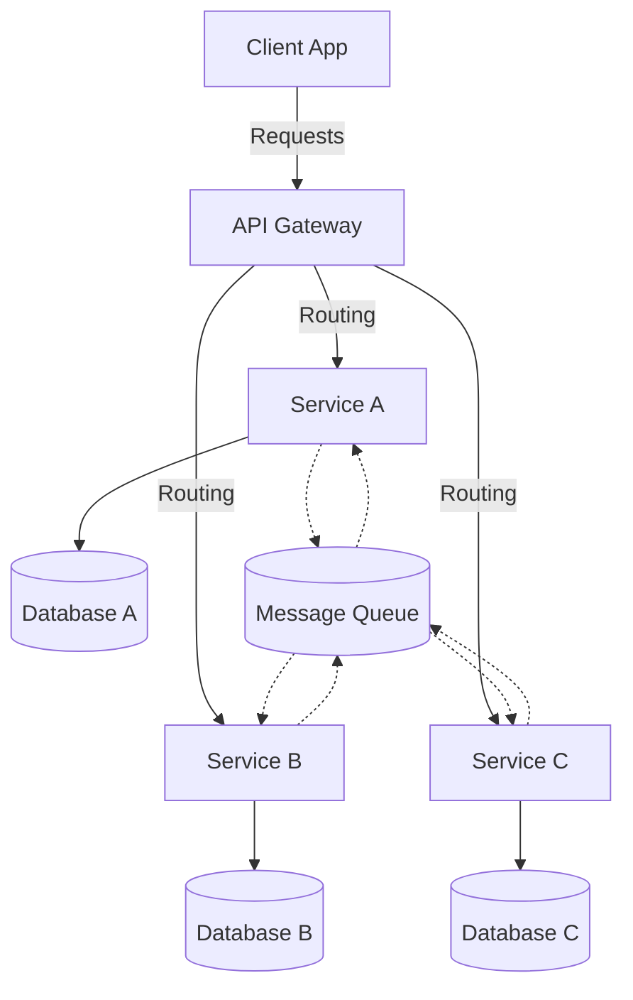
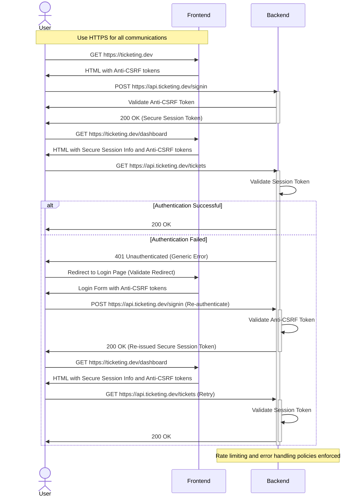
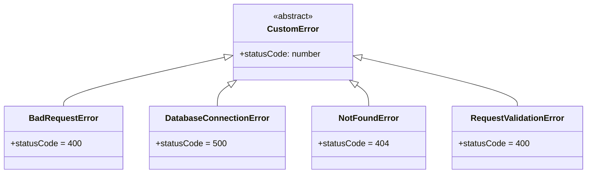

# ticketing

```mermaid
graph LR
    client[Client] -->|Creates Post| posts[Posts Service]
    client -->|Creates Comment| comments[Comments Service]
    posts -->|Post Created Event| eventbus[Event Bus]
    comments -->|Comment Created Event| eventbus
    eventbus -->|Distribute Events| query[Query Service]
    eventbus -->|Distribute Events| moderation[Moderation Service]
    eventbus -->|Distribute Events| comments
    moderation -->|Comment Moderated Event| eventbus
    query -->|Serves Aggregated Data| client
```

```mermaid
sequenceDiagram
  participant Client as Client
  participant Server as Express Server
  participant Middleware as Validation Middleware
  participant User as User Model
  participant DB as MongoDB
  participant JWT as JWT Library
  Client->>Server: POST /api/users/signup
  Server->>Middleware: Pass request to Validation Middleware
  Middleware-->>Server: Validation result
  Server->>User: findOne({ email })
  User->>DB: findOne({ email })
  DB-->>User: Existing user (or null)
  User-->>Server: Existing user (or null)
  Server->>User: build({ email, password })
  User->>DB: save new user
  DB-->>User: Saved user
  User-->>Server: Saved user
  Server->>JWT: sign({ id, email }, 'process.env.JWT_KEY!')
  JWT-->>Server: JWT
  Server-->>Client: 201 Created, user
```

```mermaid
graph TB;
    Client[Client App] -->|Requests| AG[API Gateway]
    AG -->|Routing| MS1[Service A]
    AG -->|Routing| MS2[Service B]
    AG -->|Routing| MS3[Service C]

    MS1 --> DB1[(Database A)]
    MS2 --> DB2[(Database B)]
    MS3 --> DB3[(Database C)]

    MS1 -.-> MQ[(Message Queue)]
    MS2 -.-> MQ
    MS3 -.-> MQ

    MQ -.-> MS1
    MQ -.-> MS2
    MQ -.-> MS3
```

```mermaid
sequenceDiagram
    actor User
    participant Frontend
    participant Backend

    Note over User,Frontend: Use HTTPS for all communications

    User->>Frontend: GET https://ticketing.dev
    Frontend->>User: HTML with Anti-CSRF tokens

    User->>Backend: POST https://api.ticketing.dev/signin
    activate Backend
    Backend->>User: Validate Anti-CSRF Token
    Backend->>User: 200 OK (Secure Session Token)
    deactivate Backend

    User->>Frontend: GET https://ticketing.dev/dashboard
    Frontend->>User: HTML with Secure Session Info and Anti-CSRF tokens

    User->>Backend: GET https://api.ticketing.dev/tickets
    activate Backend
    Backend->>Backend: Validate Session Token
    alt Authentication Successful
        Backend->>User: 200 OK
    else Authentication Failed
        Backend->>User: 401 Unauthenticated (Generic Error)
        User->>Frontend: Redirect to Login Page (Validate Redirect)
        Frontend->>User: Login Form with Anti-CSRF tokens
        User->>Backend: POST https://api.ticketing.dev/signin (Re-authenticate)
        activate Backend
        Backend->>Backend: Validate Anti-CSRF Token
        Backend->>User: 200 OK (Re-issued Secure Session Token)
        deactivate Backend
        User->>Frontend: GET https://ticketing.dev/dashboard
        Frontend->>User: HTML with Secure Session Info and Anti-CSRF tokens
        User->>Backend: GET https://api.ticketing.dev/tickets (Retry)
        activate Backend
        Backend->>Backend: Validate Session Token
        Backend->>User: 200 OK
        deactivate Backend
    end
    deactivate Backend

    Note over Backend: Rate limiting and error handling policies enforced
```

```mermaid
classDiagram
CustomError <|-- BadRequestError
CustomError <|-- DatabaseConnectionError
CustomError <|-- NotFoundError
CustomError <|-- RequestValidationError
class CustomError {
  <<abstract>>
  +statusCode: number
}
class BadRequestError {
  +statusCode = 400
}
class DatabaseConnectionError {
  +statusCode = 500
}
class NotFoundError {
  +statusCode = 404
}
class RequestValidationError {
  +statusCode = 400
}
```